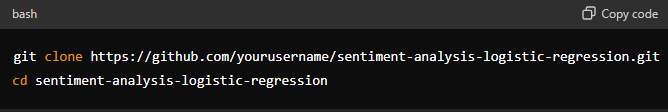

# Sentiment-Analysis

This repository contains a sentiment analysis project using a Logistic Regression model on Bag of Words (BoW) and TF-IDF features. The project is organized into several scripts and Jupyter notebooks, each handling different aspects of the data processing, feature extraction, model training, and evaluation.

## Repository Structure
1. *global_imports.py*: Contains all the necessary library imports used across different scripts and notebooks.
2. *analysis.ipynb*: Jupyter notebook for exploratory data analysis (EDA) on the dataset.
3. *data_preprocessing.py*: Handles the data preprocessing steps including data cleaning, tokenization, and splitting the dataset into training and testing sets.
4. *feature_extraction.py*: Script to extract features using Bag of Words (BoW) and TF-IDF methods.
5. *model.py*: Contains the implementation of the Logistic Regression model training.
6. *evaluation.ipynb*: for evaluating the model performance including prediction, accuracy, classification report, confusion matrix, and visualizing results using word clouds.

### Setup and Installation

1. Clone the repository:

*git clone https://github.com/yourusername/SENTIMENT-ANALYSIS.git*
*cd SENTIMENT-ANALYSIS*

2. Install the required packages:

- pip install -r requirements.txt

